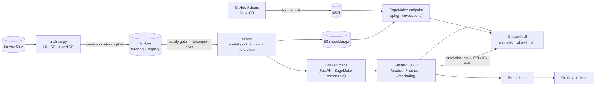

# 🧠 MindMetrics — End-to-End MLOps for Student Mental-Health Score Prediction

Regression model (social-media usage, sleep, stress, … → `Mental_Health_Score`) taken from a notebook to a **tracked, tested, containerised, CI/CD-deployed, monitored** service.



| Layer | Tech | Where |
|---|---|---|
| Experiment tracking + model registry | MLflow 2.22 (params, metrics, plots, signature, `champion` alias) | `src/train.py` |
| Reproducible training | sklearn `Pipeline` + `ColumnTransformer`, `RandomizedSearchCV`, quality gate | `src/pipeline.py` |
| Model serving | FastAPI + Pydantic v2 validation, batch endpoint, SageMaker contract (`/ping`, `/invocations`) | `serving/` |
| Containerisation | one slim non-root image for local **and** SageMaker | `Dockerfile`, `docker/` |
| CI/CD | lint → tests → quick train → image build → container smoke test → (main) full train → ECR → S3 → SageMaker → live smoke test; AWS via OIDC (no keys) | `.github/workflows/` |
| Cloud deployment | AWS SageMaker real-time (`ml.t2.medium`) — serverless was evaluated but its cold-start window is too tight for this dependency stack; see Known Limitations | `deploy/` |
| Monitoring | Prometheus metrics, Grafana dashboard, alert rules, PSI + KS drift, prediction logs, CloudWatch on AWS | `src/drift.py`, `monitoring/` |
| UI | Streamlit: animated gauge, sensitivity "nudges", what-if lab, live drift page, model card | `ui/` |

---

## Start-to-end runbook

### 0. Prerequisites
Python 3.11, Docker (+ Compose v2), Git. For AWS: an AWS account, AWS CLI v2 configured (`aws configure`), and a GitHub repo.

### 1. Local run (no Docker) — 5 terminals max
```bash
make install && source .venv/bin/activate     # venv + all deps
export PYTHONPATH=$PWD                        # (Makefile does this for you when using make)

make test                                     # 1) unit + API tests
make train                                    # 2) trains 3 models, logs to MLflow, promotes champion, exports ./models
make mlflow-ui                                # 3) http://localhost:5000  (experiments + model registry)
make serve                                    # 4) http://localhost:8000/docs  (FastAPI)
make ui                                       # 5) http://localhost:8501  (Streamlit)
```
`make train` prints each candidate's R²/MAE/RMSE and ends with `Exported champion v1 (...) -> models/`.

### 2. Full stack in Docker (MLflow + API + UI + Prometheus + Grafana)
```bash
make train            # creates ./models (needed by the API container)  — or: make train-docker
make up               # stop `make mlflow-ui` first: both use port 5000
```
| Service | URL |
|---|---|
| Streamlit UI | http://localhost:8501 |
| FastAPI docs | http://localhost:8000/docs |
| MLflow | http://localhost:5000 |
| Prometheus / Grafana | http://localhost:9090 · http://localhost:3000 (dashboard "Mental-Health Model – Serving & Drift") |

Try the API directly:
```bash
curl -s -X POST localhost:8000/predict -H 'Content-Type: application/json' -d '{
 "Age":21,"Gender":"Female","Country":"India","Academic_Level":"Undergraduate","Most_Used_Platform":"Instagram",
 "Purpose_Of_Use":"Entertainment","Avg_Daily_Usage_Hours":4.5,"Daily_Unlocks":150,"Study_Hours":3.0,
 "Physical_Activity_Hours":1.5,"Sleep_Hours_Per_Night":7.0,"Stress_Level":"Medium"}'
```

### 3. Watch monitoring work (the best 2 minutes of a demo)
```bash
make drift-demo       # or use the buttons in the UI → 📈 Monitoring tab
```
Normal traffic (held-out rows replayed) → **stable**. Drifted traffic (more screen time, less sleep, higher stress, TikTok-heavy) → **drift**, PSI bars turn red, `mh_drift_level` hits 2 in Prometheus, and the `ModelInputDrift` alert fires after 2 min. (PSI is noisy below ~300 rows — an occasional *warning* on "normal" traffic is expected.)

### 4. One-time AWS setup (ECR, S3, SageMaker role, GitHub OIDC role)
```bash
export AWS_REGION=us-east-1
export GITHUB_REPO=<your-github-username>/student-mental-health-mlops
bash deploy/aws_bootstrap.sh
```
It prints 4 repository **variables** and 2 **secrets** → add them in GitHub → *Settings → Secrets and variables → Actions*. Also create an Actions *environment* called `production` (add yourself as a required reviewer for a manual approval gate).

### 5. Push to GitHub → CI/CD does everything
```bash
git init && git add . && git commit -m "MLOps project"
git branch -M main && git remote add origin git@github.com:<you>/student-mental-health-mlops.git && git push -u origin main
```
* **CI** (every push/PR): ruff → pytest → quick MLflow training → Docker build → run the container and hit `/ping`, `/invocations`, `/metrics`.
* **CD** (after CI passes on `main`): full training with quality gate (R² ≥ 0.6) → package `model.tar.gz` → push image to ECR (`:<sha>` + `:latest`) → upload model to `s3://…/models/<sha>/` → create/update the SageMaker endpoint → smoke-test the live endpoint.

First endpoint creation takes ~3–8 min. Re-deploys update in place (no downtime).

### 6. Point the UI at SageMaker
```bash
PREDICT_BACKEND=sagemaker SAGEMAKER_ENDPOINT=student-mental-health-endpoint AWS_REGION=us-east-1 \
  streamlit run ui/app.py            # uses your local AWS credentials
```
Or invoke it from the CLI: `python deploy/sagemaker/invoke.py --endpoint-name student-mental-health-endpoint`.

*Manual deploy without CI:* `make package`, `docker build/push` to ECR, `aws s3 cp build/model.tar.gz s3://…`, then `make deploy ENDPOINT=… IMAGE_URI=… MODEL_DATA=… ROLE_ARN=…`.

### 7. Monitoring on AWS
* **CloudWatch metrics**: `Invocations`, `ModelLatency`, `Invocation4XXErrors/5XXErrors` per endpoint.
* **CloudWatch Logs** (`/aws/sagemaker/Endpoints/<name>`): the container prints one JSON line per prediction (`"event":"prediction"`) → query with Logs Insights, e.g. `filter event="prediction" | stats count() by bin(1h)`.
* **Drift**: `src/drift.py` is the same code path that runs locally; for a scheduled job, feed it those logged rows (or Data Capture files from `--mode realtime --capture-bucket …`).

### 8. Clean up (avoid charges)
```bash
make teardown ENDPOINT=student-mental-health-endpoint      # deletes endpoint, configs, models
# optional: aws ecr delete-repository --repository-name student-mental-health-api --force
#           aws s3 rb s3://<bucket> --force
```
Real-time endpoints bill continuously while `InService` (no scale-to-zero). Run `make teardown ENDPOINT=student-mental-health-endpoint` when you're done demoing, and redeploy via Actions → CD → *Run workflow* before your next session (~4–5 min).

---

## Results (held-out 20 %, seed 42)
| Model | Test R² | MAE | RMSE | Train R² |
|---|---|---|---|---|
| Linear regression (baseline) | 0.743 | 0.534 | 0.678 | 0.726 |
| **Random forest (default) — champion** | **0.890** | **0.327** | **0.443** | 0.983 |
| Random forest (tuned, 15×5-fold search) | 0.876 | 0.353 | 0.471 | 0.956 |

(Measured on sklearn 1.8 in my sandbox; expect ±0.01 with the pinned 1.6.1. Your MLflow UI has the authoritative numbers.)

## Design decisions worth knowing (interview material)
* **No train/serve skew** — cleaning + country-bucketing live in `src/features.py`, used by training *and* the API; the sklearn pipeline is a single artifact.
* **Model decoupled from image** — image is built once; the model arrives via `/opt/ml/model` (compose volume / SageMaker `model.tar.gz`), so models can ship without rebuilding.
* **Registry-driven promotion** — a new version only takes the `champion` alias if its test RMSE beats the incumbent; the exported artifact always comes *from the registry*.
* **Drift reference = held-out test set**, stored with the model, so monitoring needs no access to training data.
* **What-if / nudge calls are not logged** (`?log=false`) so analysis traffic never pollutes drift stats.

## Honest limitations (say these before an interviewer asks)
* The dataset is a survey-style, likely synthetic/idealised collection; R² ≈ 0.89 shows the model captured its structure, **not** that it can assess real wellbeing. The UI is labelled an educational demo, not a clinical tool.
* The champion is chosen on the same test split it's reported on (slightly optimistic); a stricter setup would select on CV and keep a final untouched holdout.
* The default RF overfits (train 0.98 vs test 0.89). It still wins on test error; a tuned/regularised model is the alternative if you prefer lower variance.
* Drift logic is intentionally lightweight (PSI + KS). Ground-truth labels aren't available at inference, so *performance* monitoring isn't possible — only input/output drift.
* `models/legacy/Mental_Health_Model.pkl` (from your notebook) was saved with scikit-learn 1.6.1 and can't be loaded by newer versions; that's exactly why this repo retrains reproducibly and pins `scikit-learn==1.6.1`. Note the notebook text says 80/20 but its code used a 30 % test split — this project uses 20 %.

## Resume bullets (adapt to your numbers)
* Built an end-to-end MLOps pipeline for a student wellbeing regression model (R² 0.89): **MLflow** experiment tracking + model registry with automated champion promotion and a CI quality gate.
* Served the model via **FastAPI** (Pydantic validation, batch + SageMaker-compatible `/invocations`) in a single **Docker** image reused locally and on **AWS SageMaker** (real-time inference; evaluated and rejected serverless due to cold-start constraints for this dependency stack).
* Implemented **GitHub Actions CI/CD**: lint, tests, container smoke tests, then automated train → ECR → S3 → SageMaker deploy with **OIDC** (no static AWS keys).
* Added **model monitoring**: Prometheus/Grafana metrics + alert rules, PSI/KS data & prediction drift on a rolling window, CloudWatch prediction logs.
* Designed an animated **Streamlit** app with sensitivity analysis, what-if simulations, and a live drift dashboard.

## Troubleshooting
| Symptom | Fix |
|---|---|
| API returns 503 "Model not loaded" | run `make train` (creates `./models`), then restart the API |
| `ModuleNotFoundError: src` | `export PYTHONPATH=$PWD` (or use `make …`) |
| Port 5000 busy | you're running both `make mlflow-ui` and compose — stop one |
| UI says backend offline | check `API_URL`; in Docker it must be `http://api:8080` |
| CD fails at "Assume role" | re-run `aws_bootstrap.sh` with the exact `GITHUB_REPO=owner/repo`; ensure workflow has `id-token: write` |
| Endpoint stuck `Creating` / fails | CloudWatch Logs `/aws/sagemaker/Endpoints/<name>`; usual causes: model.tar.gz files not at archive root, wrong image URI |
